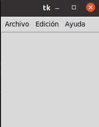
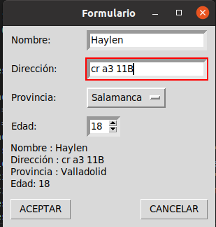
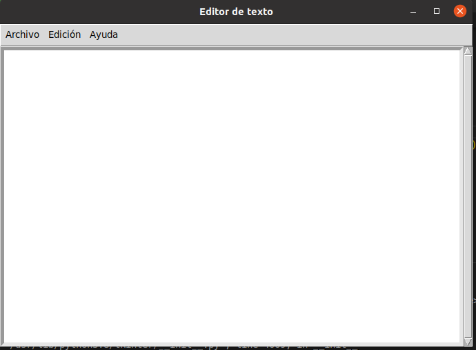

# 5 WIGETS

## Button
### Este progama tiene la función de contavilizar el tiempo cuando se decida y parar cunado usted lo desee

## Entry
### Es un modelo de interfaz para un inicio de secion 

## Label reloj
### Es una interfaz que muestra la hora real del momento

## Listbox
### Se muestrala traducción de una palabra a un idioma diferente

## Menu
### Interfaz de muenu que muetra obciones como: Archivo, edicion y ayuda

## Menu button
### Interfaz que mustra un formulario con diferente preguntas para responder según la información personal de la persona

## Messagebox
### Interfaz que muetra obciones como: Archivo, edicion y ayuda

## Option menu
### Interfaz de formulario con preguntas personales

## Scale arco
### Este programa tiene la funcion de crear una circunferencia con la medida que desee 

## Scroll
### Interfaz con funcion de escribir un texto y modificarlo o guardarlo 

## Spinbox
### Formulario con diferentes preguntas 

## Text
### Editor de texto con diferentes opciones

## Toplevel
### Ventana de acceso desde la cual puede ingresar para crear un usuario
